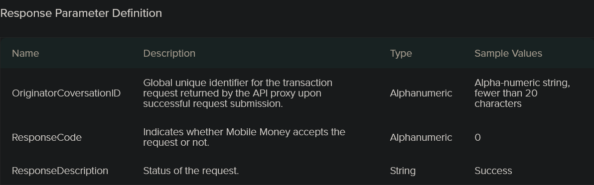

# M-Pesa Gateway Endpoints Reference

This file explains the M-Pesa API endpoints in this project:

- what each endpoint does
- when to use it
- required parameters
- expected response

Base URL for local testing:

```text
http://127.0.0.1:8000
```

Internal M-Pesa API prefix:

```text
/api/v1/mpesa
```

## Common Rules

All internal M-Pesa endpoints require this header:

```text
x-api-key: your INTERNAL_API_KEY value
```

If the key is missing, the API returns:

```json
{
  "detail": "Field required"
}
```

If the key is wrong, the API returns:

```json
{
  "detail": "Invalid internal API key"
}
```

## 1. Get OAuth Token

Endpoint:

```text
GET /api/v1/mpesa/token
```

Purpose:

- gets an access token from Safaricom
- proves your consumer key and consumer secret are working

Where to use it:

- before testing other M-Pesa endpoints
- when confirming whether Daraja authentication is working

Parameters:

- Header:
  - `x-api-key`

Request body:

- none

Expected success response:

```json
{
  "access_token": "generated-access-token"
}
```

Typical failure cases:

- wrong `MPESA_CONSUMER_KEY`
- wrong `MPESA_CONSUMER_SECRET`
- wrong `MPESA_BASE_URL`
- internet or Safaricom endpoint not reachable

## 2. STK Push

Endpoint:

```text
POST /api/v1/mpesa/stk-push
```

Purpose:

- starts an M-Pesa Express STK Push request to a customer phone

Where to use it:

- customer deposits
- paybill or till payment collection
- prompting a customer to approve payment on their handset

Parameters:

- Header:
  - `x-api-key`

Request body:

```json
{
  "phone_number": "254714415034",
  "amount": 1,
  "account_reference": "41111",
  "transaction_desc": "CPact Deposit",
  "transaction_type": "CustomerPayBillOnline"
}
```

Field meanings:

- `phone_number`: Safaricom customer number in `2547XXXXXXXX` format
- `amount`: amount to charge
- `account_reference`: your internal reference, invoice number, or account number
- `transaction_desc`: short description of the payment
- `transaction_type`: usually:
  - `CustomerPayBillOnline`
  - or `CustomerBuyGoodsOnline` if the shortcode is buy goods

Expected success response:

```json
{
  "MerchantRequestID": "some-id",
  "CheckoutRequestID": "ws_CO_xxx",
  "ResponseCode": "0",
  "ResponseDescription": "Success. Request accepted for processing",
  "CustomerMessage": "Success. Request accepted for processing"
}
```

Important:

- this response only means Safaricom accepted the request
- it does not yet mean the customer has paid
- final outcome comes through callback or STK query

Typical failure cases:

- wrong passkey
- wrong shortcode
- wrong transaction type
- callback URL not reachable
- shortcode not enabled for STK

## 3. STK Query

Endpoint:

```text
POST /api/v1/mpesa/stk-query
```

Purpose:

- checks the status of an STK Push request that has already been started

Where to use it:

- when waiting for final payment status
- when callback is delayed
- when customer says they did not complete payment

Parameters:

- Header:
  - `x-api-key`

Request body:

```json
{
  "checkout_request_id": "ws_CO_17082026162341786714415034"
}
```

Field meanings:

- `checkout_request_id`: returned by the earlier STK Push request

Expected response:

- Safaricom returns the state of that STK request
- successful, failed, cancelled, or pending depending on transaction state

Typical things to look for:

- `ResponseCode`
- `ResponseDescription`
- `ResultCode`
- `ResultDesc`

## 4. Register C2B URLs

Endpoint:

```text
POST /api/v1/mpesa/c2b/register
```

Purpose:

- registers your validation and confirmation callback URLs for C2B

Where to use it:

- before using C2B validation and confirmation flows
- when updating callback domains

Parameters:

- Header:
  - `x-api-key`

Request body:

```json
{
  "OriginatorCoversationID": "6af0-****-****-************9",
  "ResponseCode": "00000000",
  "ResponseDescription": "Success"

```

Field meanings:

 

Expected response:

- Safaricom confirms the callback URLs were registered

Typical failure cases:

- invalid callback URLs
- callback URL contains blocked keywords such as `M-PESA`, `M-Pesa`, or `mpesa`
- shortcode not enabled for C2B
- wrong environment credentials

## 5. Simulate C2B Payment

Endpoint:

```text
POST /api/v1/mpesa/c2b/simulate
```

Purpose:

- simulates a C2B payment in sandbox

Where to use it:

- sandbox testing only
- validating confirmation and validation callbacks

Parameters:

- Header:
  - `x-api-key`

Request body:

```json
{
  "amount": 10,
  "phone_number": "254714415034",
  "bill_ref_number": "TEST-REF-1",
  "command_id": "CustomerPayBillOnline",
  "shortcode": "600000"
}
```

Field meanings:

- `amount`: test amount
- `phone_number`: test MSISDN
- `bill_ref_number`: your bill reference
- `command_id`: command for the simulation
- `shortcode`: optional shortcode override

Expected response:

- Safaricom accepts the simulation request

Important:

- this endpoint is normally not for production use

## 6. B2C Payment

Endpoint:

```text
POST /api/v1/mpesa/b2c
```

Purpose:

- sends money from your organization to a customer phone

Where to use it:

- withdrawals
- refunds
- payouts
- salaries

Parameters:

- Header:
  - `x-api-key`

Request body:

```json
{
  "phone_number": "254714415034",
  "amount": 10,
  "remarks": "Salary test",
  "command_id": "BusinessPayment",
  "occasion": "August payout",
  "originator_conversation_id": "optional-id"
}
```

Field meanings:

- `phone_number`: recipient phone number
- `amount`: amount to send
- `remarks`: transaction notes
- `command_id`: B2C command type
- `occasion`: optional business note
- `originator_conversation_id`: optional unique tracking ID

Expected response:

- Safaricom accepts the request for asynchronous processing
- final outcome comes via callback

Requirements:

- `MPESA_INITIATOR_NAME`
- `MPESA_SECURITY_CREDENTIAL`
- B2C enabled on the shortcode

## 7. B2B Payment

Endpoint:

```text
POST /api/v1/mpesa/b2b
```

Purpose:

- sends money from one business shortcode to another

Where to use it:

- settlement
- merchant transfers
- inter-business payments

Parameters:

- Header:
  - `x-api-key`

Request body:

```json
{
  "receiver_shortcode": "600000",
  "amount": 10,
  "remarks": "B2B test",
  "command_id": "BusinessPayBill",
  "account_reference": "B2B-TEST",
  "sender_identifier_type": "4",
  "receiver_identifier_type": "4"
}
```

Field meanings:

- `receiver_shortcode`: target business shortcode
- `amount`: amount to send
- `remarks`: transfer notes
- `command_id`: B2B command type
- `account_reference`: internal reference
- `sender_identifier_type`: sender identifier type
- `receiver_identifier_type`: receiver identifier type

Expected response:

- Safaricom accepts the request for asynchronous processing
- final status comes via callback

Requirements:

- `MPESA_INITIATOR_NAME`
- `MPESA_SECURITY_CREDENTIAL`
- B2B enabled on the shortcode

## 7A. B2Pochi Production

Endpoint:

```text
POST /api/v1/mpesa/b2pochi-prod
```

Purpose:

- B2Pochi API is a version of Business to Customer API used to make payments from a Business to Customers business wallet locally known as pochi la biashara(microSME)

Where to use it:

- business-to-pochi payouts
- merchant wallet disbursements where Safaricom has enabled B2Pochi for your shortcode

Parameters:

- Header:
  - `x-api-key`
- CommandID
   -  BusinessPayToPochi : to send money to a customer's business wallet (pochi la biashara). 
   -  SalaryPayment : Send salary to registered M-PESA customers. -
   - BusinessPayment : Standard business-to-customer payment (registered customers only). 
   - - **PromotionPayment**: Promotional payment with a congratulatory message (registered customers only).
- OriginatorConversationID  -	Unique string generated by the merchant system for every B2C request to avoid double disbursement. You can use this ID to query the status of a transaction before making another disbursement. 
- Remarks 	- Additional information sent with the request (2–100 characters).
- Occassion  -	Additional information sent with the request (1–100 characters).
Request body:

```json
{
  "phone_number": "254714415034",
  "amount": 10,
  "remarks": "B2Pochi payment",
  "command_id": "BusinessPayToPochi",
  "occasion": "Wallet payout",
  "originator_conversation_id": "optional-id"
}
```

Field meanings:

- `phone_number`: recipient phone number in `2547XXXXXXXX` format
- `amount`: amount to send
- `remarks`: transfer notes
- `command_id`: B2Pochi command, usually `BusinessPayment`
- `occasion`: optional business note
- `originator_conversation_id`: optional unique tracking ID

Expected response:

- Safaricom accepts the request for asynchronous processing
- final result is expected on the existing B2C result and timeout callbacks

Requirements:

- `MPESA_INITIATOR_NAME`
- `MPESA_SECURITY_CREDENTIAL`
- B2Pochi enabled by Safaricom on the production shortcode

## 8. Transaction Status Query

Endpoint:

```text
POST /api/v1/mpesa/transaction-status
```

Purpose:

- checks the status of a known M-Pesa transaction

Where to use it:

- audit and reconciliation
- support follow-up
- transaction investigation

Parameters:

- Header:
  - `x-api-key`

Request body:

```json
{
  "transaction_id": "OEI2AK4Q16",
  "remarks": "Status check",
  "occasion": "Audit",
  "identifier_type": "4",
  "command_id": "TransactionStatusQuery"
}
```

Field meanings:

- `transaction_id`: M-Pesa transaction ID
- `remarks`: reason for the query
- `occasion`: optional context
- `identifier_type`: identifier type used by Safaricom
- `command_id`: query command

Expected response:

- Safaricom accepts the request
- final result is usually returned asynchronously via callback

Requirements:

- `MPESA_INITIATOR_NAME`
- `MPESA_SECURITY_CREDENTIAL`

## 9. Reversal

Endpoint:

```text
POST /api/v1/mpesa/reversal
```

Purpose:

- requests reversal of an M-Pesa transaction

Where to use it:

- mistaken transfers
- customer refund reversal process
- operational corrections

Parameters:

- Header:
  - `x-api-key`

Request body:

```json
{
  "transaction_id": "OEI2AK4Q16",
  "amount": 10,
  "remarks": "Reversal test",
  "occasion": "Correction",
  "receiver_party": "600000",
  "receiver_identifier_type": "11",
  "command_id": "TransactionReversal"
}
```

Field meanings:

- `transaction_id`: transaction to reverse
- `amount`: reversal amount
- `remarks`: reason for reversal
- `occasion`: optional note
- `receiver_party`: optional receiving party
- `receiver_identifier_type`: receiver identifier type
- `command_id`: reversal command

Expected response:

- Safaricom accepts the reversal request
- final result comes asynchronously through callback

Requirements:

- `MPESA_INITIATOR_NAME`
- `MPESA_SECURITY_CREDENTIAL`

## 10. Account Balance

Endpoint:

```text
POST /api/v1/mpesa/account-balance
```

Purpose:

- checks the balance for the configured shortcode

Where to use it:

- operational monitoring
- treasury checks
- balance validation before payouts

Parameters:

- Header:
  - `x-api-key`

Request body:

```json
{
  "remarks": "Balance check",
  "identifier_type": "4",
  "command_id": "AccountBalance"
}
```

Field meanings:

- `remarks`: reason for balance query
- `identifier_type`: shortcode identifier type
- `command_id`: balance query command

Expected response:

- Safaricom accepts the request
- actual result usually comes back asynchronously via callback

Requirements:

- `MPESA_INITIATOR_NAME`
- `MPESA_SECURITY_CREDENTIAL`

## 11. M-Pesa Ratiba

Endpoint:

```text
POST /api/v1/mpesa/ratiba
```

Purpose:

- creates an M-Pesa Ratiba standing order request
- supports recurring or scheduled payment flows

Where to use it:

- subscriptions
- recurring bill payments
- installment plans
- scheduled customer payment arrangements

Parameters:

- Header:
  - `x-api-key`

Request body:

```json
{
  "payload": {
    "CallBackURL": "https://your-domain.com/callbacks/mpesa/ratiba",
    "ExampleField": "value"
  }
}
```

How this endpoint works:

- you send the official Ratiba request body inside `payload`
- if `CallBackURL` is missing, the gateway automatically uses `MPESA_RATIBA_CALLBACK_URL`
- the gateway forwards the payload to Safaricom's Ratiba standing order endpoint

Expected response:

- Safaricom accepts or rejects the standing order creation request
- follow-up Ratiba events are expected on the Ratiba callback route

Important:

- the public Daraja Ratiba page was available, but the detailed request schema was not exposed line-by-line in the public page available to this assistant on August 18, 2026
- this route is therefore implemented as a clean pass-through so you can send the exact Ratiba fields approved for your Safaricom setup

## 12. Dynamic QRCode

Endpoint:

```text
POST /api/v1/mpesa/dynamic-qrcode/generate
```

Purpose:

- generates a dynamic M-Pesa QR code

Request body:

```json
{
  "MerchantName": "Demo Store",
  "RefNo": "INV1001",
  "Amount": "10",
  "TrxCode": "BG",
  "CPI": "174379",
  "Size": "300"
}
```

How this endpoint works:

- sends the provided payload to `MPESA_DYNAMIC_QRCODE_GENERATE_PATH`
- default path is `/mpesa/qrcode/v1/generate`

## 13. Bill Manager

Primary endpoints:

```text
POST /api/v1/mpesa/bill-manager/invoices/create-single
POST /api/v1/mpesa/bill-manager/invoices/create-bulk
POST /api/v1/mpesa/bill-manager/invoices/cancel-single
POST /api/v1/mpesa/bill-manager/invoices/cancel-bulk
```

Purpose:

- forwards approved Bill Manager invoice operations through dedicated local routes

Example request body for bulk cancel:

```json
{
  "externalReference": "BILL-1001"
}
```

How this endpoint works:

- `create-single` uses `MPESA_BILL_MANAGER_CREATE_SINGLE_INVOICE_PATH`
- `create-bulk` uses `MPESA_BILL_MANAGER_CREATE_BULK_INVOICES_PATH`
- `cancel-single` uses `MPESA_BILL_MANAGER_CANCEL_SINGLE_INVOICE_PATH`
- `cancel-bulk` uses `MPESA_BILL_MANAGER_CANCEL_BULK_INVOICES_PATH`

## 14. Pull Transactions

Primary endpoints:

```text
POST /api/v1/mpesa/pull-transactions/query
POST /api/v1/mpesa/pull-transactions/register
```

Purpose:

- The Pull Transactions API is a reconciliation tool that lets partners query all C2B transactions performed under their Pay bill/Till number within the last 48 hours. 
- registration is exposed as its own local endpoint

Query request body:

```json
{
  "ShortCode": "174379",
  "StartDate": "2026-08-26 00:00:00",
  "EndDate": "2026-08-26 23:59:59",
  "OffSetValue": "0"
}
```

Registration request example:

```json
{}
```

How this endpoint works:

- `query` uses `MPESA_PULL_TRANSACTIONS_QUERY_PATH`
- `register` uses `MPESA_PULL_TRANSACTIONS_REGISTER_PATH`
- `StartDate` and `EndDate` must use `YYYY-MM-DD HH:MM:SS`
- `register` auto-fills `ShortCode` from `MPESA_SHORTCODE`
- `register` auto-fills `RequestType` from `MPESA_PULL_TRANSACTIONS_REQUEST_TYPE`
- `register` auto-fills `NominatedNumber` from `MPESA_PULL_TRANSACTIONS_NOMINATED_NUMBER`
- `register` auto-fills `CallBackURL` from `MPESA_PULL_TRANSACTIONS_CALLBACK_URL`
- if `MPESA_PULL_TRANSACTIONS_CALLBACK_URL` is not set, the gateway uses `{PUBLIC_BASE_URL}/callbacks/payments/pull-transactions`
- you can still pass an optional JSON body when Safaricom requires extra registration fields or an override

## 15. Mobile Number Validation

Primary endpoint:

```text
POST /api/v1/mpesa/mobile-number-validation/check-ati
```

Purpose:

- forwards a mobile number validation or related identity check payload approved for your account

Request body:

```json
{
  "phoneNumber": "254714415034"
}
```

How this endpoint works:

- uses `MPESA_MOBILE_NUMBER_VALIDATION_CHECK_ATI_PATH`
- default path is `/imsi/v2/checkATI`

## Callback Endpoints

These endpoints receive JSON directly from Safaricom.

They are not meant for your internal systems to call in normal operation.

### STK Callback

Endpoint:

```text
POST /callbacks/payments/stk
```

Purpose:

- receives final STK Push result from Safaricom

Expected incoming payload:

```json
{
  "Body": {
    "stkCallback": {
      "MerchantRequestID": "12345",
      "CheckoutRequestID": "ws_CO_12345",
      "ResultCode": 0,
      "ResultDesc": "The service request is processed successfully."
    }
  }
}
```

Expected API response back to Safaricom:

```json
{
  "ResultCode": 0,
  "ResultDesc": "Accepted"
}
```

### C2B Confirmation Callback

Endpoint:

```text
POST /callbacks/payments/c2b/confirmation
```

Purpose:

- receives confirmed C2B payment notifications

### C2B Validation Callback

Endpoint:

```text
POST /callbacks/payments/c2b/validation
```

Purpose:

- receives C2B validation requests from Safaricom

### B2C Result Callback

Endpoint:

```text
POST /callbacks/payments/b2c/result
```

Purpose:

- receives final B2C result

### B2C Timeout Callback

Endpoint:

```text
POST /callbacks/payments/b2c/timeout
```

Purpose:

- receives B2C timeout notification

### B2B Result Callback

Endpoint:

```text
POST /callbacks/payments/b2b/result
```

Purpose:

- receives final B2B result

### B2B Timeout Callback

Endpoint:

```text
POST /callbacks/payments/b2b/timeout
```

Purpose:

- receives B2B timeout notification

### Transaction Status Result Callback

Endpoint:

```text
POST /callbacks/payments/transaction-status/result
```

Purpose:

- receives transaction status result

### Transaction Status Timeout Callback

Endpoint:

```text
POST /callbacks/payments/transaction-status/timeout
```

Purpose:

- receives transaction status timeout callback

### Reversal Result Callback

Endpoint:

```text
POST /callbacks/payments/reversal/result
```

Purpose:

- receives reversal result

### Reversal Timeout Callback

Endpoint:

```text
POST /callbacks/payments/reversal/timeout
```

Purpose:

- receives reversal timeout notification

### Account Balance Result Callback

Endpoint:

```text
POST /callbacks/payments/account-balance/result
```

Purpose:

- receives account balance result

### Account Balance Timeout Callback

Endpoint:

```text
POST /callbacks/payments/account-balance/timeout
```

Purpose:

- receives account balance timeout notification

### Ratiba Callback

Endpoint:

```text
POST /callbacks/payments/ratiba
```

Purpose:

- receives Ratiba callback JSON from Safaricom

### Pull Transactions Callback

Endpoint:

```text
POST /callbacks/payments/pull-transactions
```

Purpose:

- receives Pull Transactions callback JSON from Safaricom

## Where Callback JSON Is Saved

The latest callback payloads are saved locally in:

- `C:\Users\user\Desktop\Kotlin Apps\Mpesa_integration\python\callback_data`

Examples:

- `stk_latest.json`
- `b2c_result_latest.json`
- `transaction_status_result_latest.json`
- `pull_transactions_latest.json`

## Summary

Use these endpoints in this order:

1. `/api/v1/mpesa/token`
2. `/api/v1/mpesa/stk-push`
3. `/api/v1/mpesa/stk-query`
4. `/api/v1/mpesa/c2b/register`
5. `/api/v1/mpesa/c2b/simulate`
6. `/api/v1/mpesa/b2c`
7. `/api/v1/mpesa/b2b`
8. `/api/v1/mpesa/transaction-status`
9. `/api/v1/mpesa/reversal`
10. `/api/v1/mpesa/account-balance`
11. `/api/v1/mpesa/ratiba`
12. `/api/v1/mpesa/dynamic-qrcode/generate`
13. `/api/v1/mpesa/bill-manager/invoices/create-single`
14. `/api/v1/mpesa/bill-manager/invoices/create-bulk`
15. `/api/v1/mpesa/bill-manager/invoices/cancel-single`
16. `/api/v1/mpesa/bill-manager/invoices/cancel-bulk`
17. `/api/v1/mpesa/pull-transactions/query`
18. `/api/v1/mpesa/pull-transactions/register`
19. `/api/v1/mpesa/mobile-number-validation/check-ati`

Use callback endpoints only for Safaricom callback delivery.
